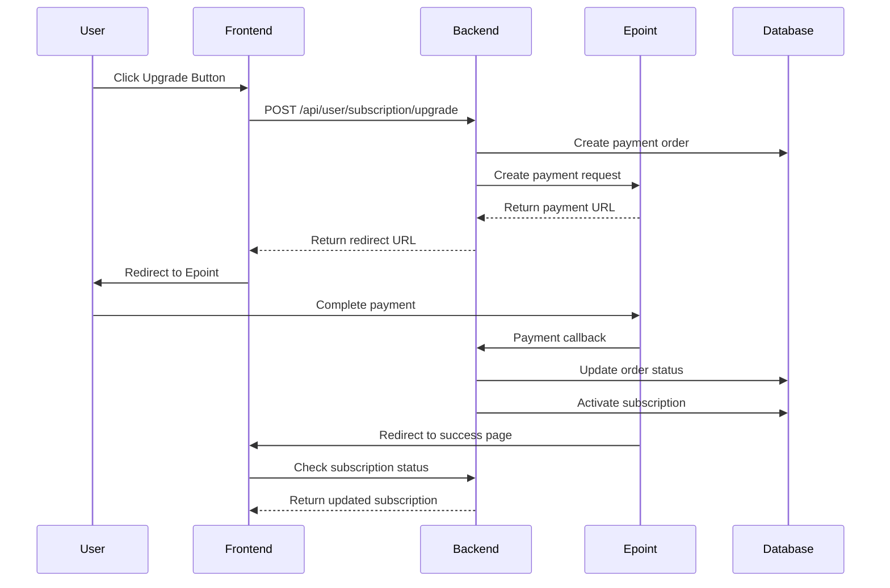

# 📋 Subscription Upgrade Frontend Integration Guide

Bu sənəd frontend komandası üçün subscription upgrade funksionallığının inteqrasiyası haqqında ətraflı məlumat verir.

## 🎯 Ümumi Baxış

Backlify sistemində istifadəçilər subscription planlarını yüksəldə bilərlər. Sistem Epoint payment gateway istifadə edərək ödənişləri emal edir və payment sonrası subscription planını avtomatik olaraq yeniləyir.

## 📊 Mövcud Planlar

| Plan | Qiymət | Xüsusiyyətlər |
|------|--------|---------------|
| Basic | Pulsuz | 1000 sorğu/ay, Email dəstək |
| Pro | 0.01 AZN | 10000 sorğu/ay, Prioritet dəstək, Custom domain |
| Enterprise | 0.02 AZN | Limitsiz sorğu, 24/7 dəstək, Custom inteqrasiya, SLA zəmanət |

## 🔌 API Endpoint-ləri

### 1. Subscription Upgrade

**Endpoint:** `POST /api/user/subscription/upgrade`

**Məqsəd:** İstifadəçinin subscription planını yüksəltmək

**Headers:**
```javascript
{
  'Authorization': 'Bearer <token>',
  'Content-Type': 'application/json'
}
```

**Request Body:**
```javascript
{
  "plan": "pro" // və ya "enterprise"
}
```

**Response (Success):**
```javascript
{
  "success": true,
  "message": "Subscription upgrade initiated",
  "data": {
    "redirectUrl": "https://epoint.az/checkout/...",
    "orderId": "SUB_1234567890_userId",
    "plan": "pro",
    "amount": 0.01
  }
}
```

**Response (Error):**
```javascript
{
  "success": false,
  "error": "Plan is required" // və ya digər error mesajları
}
```

### 2. Get Current Subscription

**Endpoint:** `GET /api/user/subscription`

**Məqsəd:** İstifadəçinin cari subscription statusunu əldə etmək

**Headers:**
```javascript
{
  'Authorization': 'Bearer <token>'
}
```

**Response:**
```javascript
{
  "success": true,
  "data": [
    {
      "id": 1,
      "user_id": "uuid",
      "plan_id": "pro",
      "api_id": null,
      "status": "active",
      "start_date": "2024-01-01T00:00:00Z",
      "expiration_date": "2024-01-31T00:00:00Z",
      "created_at": "2024-01-01T00:00:00Z",
      "updated_at": "2024-01-01T00:00:00Z"
    }
  ]
}
```

### 3. Get Available Plans

**Endpoint:** `GET /api/payment/plans`

**Məqsəd:** Mövcud planları və qiymətləri əldə etmək

**Response:**
```javascript
{
  "success": true,
  "data": [
    {
      "id": "basic",
      "name": "Basic Plan",
      "price": 0,
      "currency": "AZN",
      "features": ["Basic API access", "1000 requests/month", "Email support"]
    },
    {
      "id": "pro",
      "name": "Pro Plan",
      "price": 0.01,
      "currency": "AZN",
      "features": ["Pro API access", "10000 requests/month", "Priority support", "Custom domains"]
    },
    {
      "id": "enterprise",
      "name": "Enterprise Plan",
      "price": 0.02,
      "currency": "AZN",
      "features": ["Enterprise API access", "Unlimited requests", "24/7 support", "Custom integrations", "SLA guarantee"]
    }
  ]
}
```

### 4. Payment History

**Endpoint:** `GET /api/payment/history`

**Məqsəd:** İstifadəçinin ödəniş tarixçəsini əldə etmək

**Headers:**
```javascript
{
  'Authorization': 'Bearer <token>'
}
```

**Response:**
```javascript
{
  "success": true,
  "data": [
    {
      "id": 1,
      "user_id": "uuid",
      "plan_id": "pro",
      "amount": 0.01,
      "currency": "AZN",
      "status": "paid",
      "created_at": "2024-01-01T00:00:00Z"
    }
  ]
}
```

## 💻 Frontend Implementation

### 1. Subscription Upgrade Function

```javascript
/**
 * Subscription planını yüksəltmək üçün funksiya
 * @param {string} plan - 'pro' və ya 'enterprise'
 * @returns {Promise<Object>} - Payment redirect URL və order məlumatları
 */
const upgradeSubscription = async (plan) => {
  try {
    const token = localStorage.getItem('authToken');
    
    if (!token) {
      throw new Error('Authentication token not found');
    }

    const response = await fetch('/api/user/subscription/upgrade', {
      method: 'POST',
      headers: {
        'Authorization': `Bearer ${token}`,
        'Content-Type': 'application/json'
      },
      body: JSON.stringify({ plan })
    });

    const data = await response.json();
    
    if (!response.ok) {
      throw new Error(data.error || `HTTP error! status: ${response.status}`);
    }

    if (data.success) {
      return data.data;
    } else {
      throw new Error(data.error || 'Failed to upgrade subscription');
    }
  } catch (error) {
    console.error('Error upgrading subscription:', error);
    throw error;
  }
};
```

### 2. Get Current Subscription Function

```javascript
/**
 * İstifadəçinin cari subscription statusunu əldə etmək
 * @returns {Promise<Object>} - Subscription məlumatları
 */
const getCurrentSubscription = async () => {
  try {
    const token = localStorage.getItem('authToken');
    
    if (!token) {
      throw new Error('Authentication token not found');
    }

    const response = await fetch('/api/user/subscription', {
      headers: {
        'Authorization': `Bearer ${token}`
      }
    });

    const data = await response.json();
    
    if (!response.ok) {
      throw new Error(data.error || `HTTP error! status: ${response.status}`);
    }

    return data.data;
  } catch (error) {
    console.error('Error getting subscription:', error);
    throw error;
  }
};
```

### 3. Get Available Plans Function

```javascript
/**
 * Mövcud planları əldə etmək
 * @returns {Promise<Array>} - Planların siyahısı
 */
const getAvailablePlans = async () => {
  try {
    const response = await fetch('/api/payment/plans');
    const data = await response.json();
    
    if (!response.ok) {
      throw new Error(data.error || `HTTP error! status: ${response.status}`);
    }

    return data.data;
  } catch (error) {
    console.error('Error getting plans:', error);
    throw error;
  }
};
```

### 4. React Component Example

```jsx
import React, { useState, useEffect } from 'react';

const SubscriptionUpgrade = () => {
  const [plans, setPlans] = useState([]);
  const [currentSubscription, setCurrentSubscription] = useState(null);
  const [loading, setLoading] = useState(false);
  const [error, setError] = useState(null);

  useEffect(() => {
    loadData();
  }, []);

  const loadData = async () => {
    try {
      setLoading(true);
      const [plansData, subscriptionData] = await Promise.all([
        getAvailablePlans(),
        getCurrentSubscription()
      ]);
      
      setPlans(plansData);
      setCurrentSubscription(subscriptionData[0] || null);
    } catch (err) {
      setError(err.message);
    } finally {
      setLoading(false);
    }
  };

  const handleUpgrade = async (planId) => {
    try {
      setLoading(true);
      setError(null);
      
      const result = await upgradeSubscription(planId);
      
      // Epoint payment səhifəsinə yönləndir
      window.location.href = result.redirectUrl;
    } catch (err) {
      setError(err.message);
    } finally {
      setLoading(false);
    }
  };

  const getCurrentPlanName = () => {
    if (!currentSubscription) return 'No active subscription';
    return plans.find(p => p.id === currentSubscription.plan_id)?.name || 'Unknown';
  };

  const isUpgradeable = (planId) => {
    if (!currentSubscription) return planId !== 'basic';
    const planHierarchy = { basic: 1, pro: 2, enterprise: 3 };
    return planHierarchy[planId] > planHierarchy[currentSubscription.plan_id];
  };

  if (loading && !plans.length) {
    return <div className="loading">Loading...</div>;
  }

  return (
    <div className="subscription-upgrade">
      <h2>Subscription Management</h2>
      
      {currentSubscription && (
        <div className="current-subscription">
          <h3>Current Plan: {getCurrentPlanName()}</h3>
          <p>Status: {currentSubscription.status}</p>
          <p>Expires: {new Date(currentSubscription.expiration_date).toLocaleDateString()}</p>
        </div>
      )}

      {error && (
        <div className="error">
          {error}
        </div>
      )}

      <div className="plans-grid">
        {plans.map(plan => (
          <div key={plan.id} className={`plan-card ${currentSubscription?.plan_id === plan.id ? 'current' : ''}`}>
            <h3>{plan.name}</h3>
            <div className="price">
              {plan.price === 0 ? 'Free' : `${plan.price} ${plan.currency}`}
            </div>
            <ul className="features">
              {plan.features.map((feature, index) => (
                <li key={index}>{feature}</li>
              ))}
            </ul>
            
            {isUpgradeable(plan.id) && (
              <button 
                onClick={() => handleUpgrade(plan.id)}
                disabled={loading}
                className="upgrade-btn"
              >
                {loading ? 'Processing...' : 'Upgrade'}
              </button>
            )}
            
            {currentSubscription?.plan_id === plan.id && (
              <div className="current-badge">Current Plan</div>
            )}
          </div>
        ))}
      </div>
    </div>
  );
};

export default SubscriptionUpgrade;
```

## 🔄 Payment Flow

### 1. Upgrade Process



### 2. Payment Success Handling

```javascript
// Payment success səhifəsində (success.html və ya success component)
const handlePaymentSuccess = async () => {
  try {
    // URL-dən order_id əldə et
    const urlParams = new URLSearchParams(window.location.search);
    const orderId = urlParams.get('order_id');
    
    if (orderId) {
      // Subscription status yoxla
      const subscription = await getCurrentSubscription();
      
      if (subscription && subscription.length > 0) {
        // UI-da yeni plan göstər
        showSuccessMessage(`Successfully upgraded to ${subscription[0].plan_id} plan!`);
        
        // Dashboard-a yönləndir
        setTimeout(() => {
          window.location.href = '/dashboard';
        }, 3000);
      }
    }
  } catch (error) {
    console.error('Error handling payment success:', error);
    showErrorMessage('Error verifying payment. Please contact support.');
  }
};

// Səhifə yüklənəndə işə düş
document.addEventListener('DOMContentLoaded', handlePaymentSuccess);
```

### 3. Payment Cancel Handling

```javascript
// Payment cancel səhifəsində
const handlePaymentCancel = () => {
  const urlParams = new URLSearchParams(window.location.search);
  const orderId = urlParams.get('order_id');
  
  showInfoMessage('Payment was cancelled. You can try again anytime.');
  
  // Pricing səhifəsinə yönləndir
  setTimeout(() => {
    window.location.href = '/pricing';
  }, 2000);
};
```

## 🎨 UI/UX Guidelines

### 1. Plan Cards Design

```css
.plans-grid {
  display: grid;
  grid-template-columns: repeat(auto-fit, minmax(300px, 1fr));
  gap: 20px;
  margin: 20px 0;
}

.plan-card {
  border: 2px solid #e0e0e0;
  border-radius: 12px;
  padding: 24px;
  text-align: center;
  position: relative;
  transition: all 0.3s ease;
}

.plan-card:hover {
  border-color: #007bff;
  transform: translateY(-4px);
  box-shadow: 0 8px 25px rgba(0, 123, 255, 0.15);
}

.plan-card.current {
  border-color: #28a745;
  background-color: #f8fff9;
}

.plan-card h3 {
  margin: 0 0 16px 0;
  font-size: 24px;
  font-weight: 600;
}

.price {
  font-size: 32px;
  font-weight: 700;
  color: #007bff;
  margin: 16px 0;
}

.features {
  list-style: none;
  padding: 0;
  margin: 20px 0;
}

.features li {
  padding: 8px 0;
  border-bottom: 1px solid #f0f0f0;
}

.features li:last-child {
  border-bottom: none;
}

.upgrade-btn {
  background: linear-gradient(135deg, #007bff, #0056b3);
  color: white;
  border: none;
  padding: 12px 24px;
  border-radius: 8px;
  font-size: 16px;
  font-weight: 600;
  cursor: pointer;
  transition: all 0.3s ease;
  width: 100%;
  margin-top: 20px;
}

.upgrade-btn:hover:not(:disabled) {
  background: linear-gradient(135deg, #0056b3, #004085);
  transform: translateY(-2px);
}

.upgrade-btn:disabled {
  opacity: 0.6;
  cursor: not-allowed;
}

.current-badge {
  position: absolute;
  top: -10px;
  right: -10px;
  background: #28a745;
  color: white;
  padding: 4px 12px;
  border-radius: 20px;
  font-size: 12px;
  font-weight: 600;
}
```

### 2. Loading States

```css
.loading {
  display: flex;
  justify-content: center;
  align-items: center;
  padding: 40px;
  font-size: 18px;
  color: #666;
}

.loading::after {
  content: '';
  width: 20px;
  height: 20px;
  border: 2px solid #f3f3f3;
  border-top: 2px solid #007bff;
  border-radius: 50%;
  animation: spin 1s linear infinite;
  margin-left: 10px;
}

@keyframes spin {
  0% { transform: rotate(0deg); }
  100% { transform: rotate(360deg); }
}
```

### 3. Error Handling

```css
.error {
  background-color: #f8d7da;
  color: #721c24;
  padding: 12px 16px;
  border-radius: 8px;
  margin: 16px 0;
  border: 1px solid #f5c6cb;
}

.success {
  background-color: #d4edda;
  color: #155724;
  padding: 12px 16px;
  border-radius: 8px;
  margin: 16px 0;
  border: 1px solid #c3e6cb;
}

.info {
  background-color: #d1ecf1;
  color: #0c5460;
  padding: 12px 16px;
  border-radius: 8px;
  margin: 16px 0;
  border: 1px solid #bee5eb;
}
```

## ⚠️ Error Handling

### 1. Common Error Cases

```javascript
const handleSubscriptionError = (error) => {
  const errorMessages = {
    'User not authenticated': 'Please log in to upgrade your subscription',
    'Plan is required': 'Please select a plan to upgrade to',
    'Invalid plan': 'The selected plan is not valid',
    'Failed to create subscription order': 'Unable to process upgrade. Please try again',
    'Authentication token not found': 'Please log in again',
    'HTTP error! status: 401': 'Session expired. Please log in again',
    'HTTP error! status: 403': 'You do not have permission to perform this action',
    'HTTP error! status: 500': 'Server error. Please try again later'
  };

  const message = errorMessages[error.message] || 'An unexpected error occurred';
  showErrorMessage(message);
};
```

### 2. Network Error Handling

```javascript
const upgradeSubscriptionWithRetry = async (plan, maxRetries = 3) => {
  for (let i = 0; i < maxRetries; i++) {
    try {
      return await upgradeSubscription(plan);
    } catch (error) {
      if (i === maxRetries - 1) {
        throw error;
      }
      
      // Exponential backoff
      const delay = Math.pow(2, i) * 1000;
      await new Promise(resolve => setTimeout(resolve, delay));
    }
  }
};
```

## 🔒 Security Considerations

### 1. Token Management

```javascript
const getAuthToken = () => {
  const token = localStorage.getItem('authToken');
  
  if (!token) {
    // Redirect to login
    window.location.href = '/login';
    return null;
  }
  
  // Check token expiration (if JWT)
  try {
    const payload = JSON.parse(atob(token.split('.')[1]));
    const now = Date.now() / 1000;
    
    if (payload.exp < now) {
      localStorage.removeItem('authToken');
      window.location.href = '/login';
      return null;
    }
  } catch (error) {
    // Token is not JWT or invalid
    console.warn('Invalid token format');
  }
  
  return token;
};
```

### 2. Input Validation

```javascript
const validatePlan = (plan) => {
  const validPlans = ['pro', 'enterprise'];
  
  if (!plan || typeof plan !== 'string') {
    throw new Error('Plan is required and must be a string');
  }
  
  if (!validPlans.includes(plan)) {
    throw new Error(`Invalid plan. Valid plans are: ${validPlans.join(', ')}`);
  }
  
  return true;
};
```

## 📱 Mobile Responsiveness

```css
@media (max-width: 768px) {
  .plans-grid {
    grid-template-columns: 1fr;
    gap: 16px;
  }
  
  .plan-card {
    padding: 20px;
  }
  
  .plan-card h3 {
    font-size: 20px;
  }
  
  .price {
    font-size: 28px;
  }
  
  .upgrade-btn {
    padding: 14px 20px;
    font-size: 16px;
  }
}

@media (max-width: 480px) {
  .plan-card {
    padding: 16px;
  }
  
  .plan-card h3 {
    font-size: 18px;
  }
  
  .price {
    font-size: 24px;
  }
}
```

## 🧪 Testing

### 1. Unit Tests Example

```javascript
// subscription.test.js
describe('Subscription Upgrade', () => {
  beforeEach(() => {
    localStorage.setItem('authToken', 'mock-token');
    global.fetch = jest.fn();
  });

  afterEach(() => {
    localStorage.clear();
    global.fetch.mockClear();
  });

  test('should upgrade subscription successfully', async () => {
    const mockResponse = {
      success: true,
      data: {
        redirectUrl: 'https://epoint.az/checkout/...',
        orderId: 'SUB_123',
        plan: 'pro',
        amount: 0.01
      }
    };

    global.fetch.mockResolvedValueOnce({
      ok: true,
      json: async () => mockResponse
    });

    const result = await upgradeSubscription('pro');

    expect(result).toEqual(mockResponse.data);
    expect(global.fetch).toHaveBeenCalledWith('/api/user/subscription/upgrade', {
      method: 'POST',
      headers: {
        'Authorization': 'Bearer mock-token',
        'Content-Type': 'application/json'
      },
      body: JSON.stringify({ plan: 'pro' })
    });
  });

  test('should handle authentication error', async () => {
    localStorage.removeItem('authToken');

    await expect(upgradeSubscription('pro')).rejects.toThrow('Authentication token not found');
  });

  test('should handle server error', async () => {
    global.fetch.mockResolvedValueOnce({
      ok: false,
      status: 500,
      json: async () => ({ error: 'Internal server error' })
    });

    await expect(upgradeSubscription('pro')).rejects.toThrow('Internal server error');
  });
});
```

### 2. Integration Tests

```javascript
// integration.test.js
describe('Subscription Flow Integration', () => {
  test('complete upgrade flow', async () => {
    // 1. Load plans
    const plans = await getAvailablePlans();
    expect(plans.length).toBeGreaterThan(0);

    // 2. Get current subscription
    const currentSub = await getCurrentSubscription();
    expect(Array.isArray(currentSub)).toBe(true);

    // 3. Upgrade subscription (mock)
    const mockUpgrade = jest.fn().mockResolvedValue({
      redirectUrl: 'https://epoint.az/checkout/...',
      orderId: 'SUB_123',
      plan: 'pro',
      amount: 0.01
    });

    const result = await mockUpgrade('pro');
    expect(result.redirectUrl).toContain('epoint.az');
  });
});
```

## 📋 Checklist

### Frontend Implementation Checklist

- [ ] Authentication token management
- [ ] API integration functions
- [ ] React/Vue/Angular components
- [ ] Error handling and user feedback
- [ ] Loading states and animations
- [ ] Mobile responsive design
- [ ] Payment success/cancel pages
- [ ] Unit and integration tests
- [ ] Accessibility compliance
- [ ] Performance optimization

### Backend Integration Checklist

- [ ] CORS configuration
- [ ] Authentication middleware
- [ ] Rate limiting
- [ ] Error logging
- [ ] Payment callback handling
- [ ] Database transactions
- [ ] Security headers
- [ ] API documentation

## 🚀 Deployment Notes

1. **Environment Variables**: Ensure all required environment variables are set
2. **CORS**: Configure CORS for your frontend domain
3. **SSL**: Use HTTPS for all payment-related endpoints
4. **Monitoring**: Set up error tracking and performance monitoring
5. **Backup**: Ensure database backups are configured

## 📞 Support

Əgər hər hansı sual və ya problem varsa, backend komandası ilə əlaqə saxlayın:

- **Email**: backend@backlify.com
- **Slack**: #backend-support
- **Documentation**: [Internal API Docs](https://docs.backlify.com)

---

**Son yenilənmə:** 2024-01-15  
**Versiya:** 1.0.0  
**Müəllif:** Backend Team
